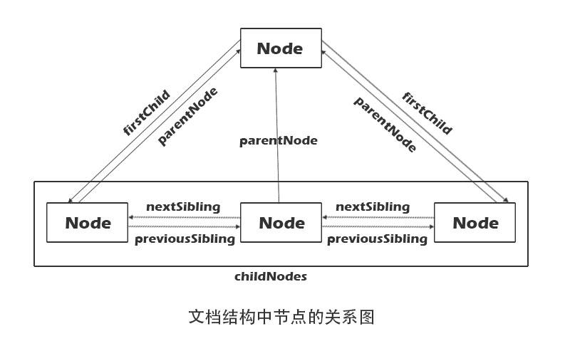

# wisdom
## 最小可用的虚拟dom库
******
### Dom相关知识点整理
##### 节点关系图


##### 节点类型
|  节点类型   | nodeType | nodeName |  |
|  ---  |---|---|
| 元素节点  |1| 'DIV'只读 |
| 文本节点  |3|'#text'|
| 属性节点  |2||
| 注释节点 |8|'#comment'|
| document |9| '#docment'|
| DocumentFragment | 11|  |
##### 查找节点
``` javascript
	// 存在 HTMLDocument
	// 性能较差，兼容性较好，不是动态存值 
	document.querySelector('css-selector') // Element
	document.querySelectorAll('css-selector') // NodeList 
	// get... 家族 
	document.getElementById('id') // 原型 Element 不存在此方法
	document.getElementsByTagName('div')// HTMLCollection
	document.getElementsByClassName('classname') // HTMLCollection
	element.hasChildNodes // 是否存在子节点
```

##### 创建节点
``` javascript
	document.createAttribute("class")	// 创建一个属性节点
    document.createComment('comments')	// 方法可创建注释节点。
    document.createDocumentFragment()	// 创建空的 DocumentFragment 对象，并返回此对象。
    document.createElement('p')	// 创建元素节点。
    document.createTextNode("Hello World")	// 创建文本节点
```

##### 更改节点
``` javascript
	element.appendChild(newChild) // 为元素添加一个新的子元素(不是新元素则剪切)
    element.replaceChild(newnode,oldnode)	// 替换一个子元素
    element.removeChild(removeChild)// 删除一个子元素(返回removeChild节点,在内存中)
	removeChild.remove() // 删除一个元素本身，不会存于内存，h5版本新方法
    element.insertBefore(newChild,existingChild)	// 现有的子元素之前插入一个新的子元素
    element.removeAttribute('style')	// 从元素中删除指定的属性
    element.innerHTML	// 设置或者返回元素的内容。
```